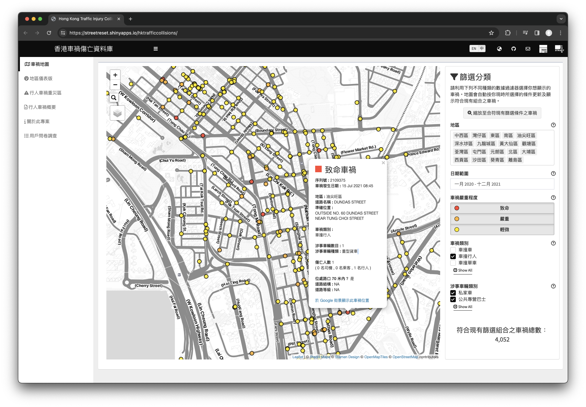

# 香港車禍傷亡資料庫 \| Hong Kong Traffic Injury Collision Database

<!-- badges: start -->

<!-- badges: end -->

[香港車禍傷亡資料庫](https://streetreset.shinyapps.io/hktrafficcollisions/)是街道變革和 Hong Kong District Info 共同開發的項目，旨在利用互動地圖和儀表版，將香港車禍位置和相關數據可視化。

這個項目有三個目標：

-   提醒公眾注意目前香港車禍的嚴重性，尤其是對行人和單車使用者的嚴重影響
-   讓各方注意到街道設計如何導致目前的情況，以及應採取哪些系統性的補救措施，以提高弱勢道路使用者的安全
-   為記者、區議員和政府部門提供簡易數據和見解，有助深入探討及改善車禍問題

[Hong Kong Traffic Injury Collision Database](https://streetreset.shinyapps.io/hktrafficcollisions/) is a project co-developed by Street Reset and Hong Kong District Info, which aims to visualise Hong Kong traffic collision data with interactive mapping. Our objective is three-fold:

-   To alert the public on the current severity of traffic collisions in Hong Kong, with particular dire implications for pedestrians and cyclists,
-   To draw attention to how street design has contributed to the current situation, and what systemic remedies should be made to enhance the safety of vulnerable road users, and
-   To provide journalists, district councillors, and government departments with insights and map-based data evidence to understand this issue.

------------------------------------------------------------------------

## Development

The Shiny app is deployed onto shinyapps.io in the links below:

-   Production: <https://streetreset.shinyapps.io/hktrafficcollisions/>
-   Development: <https://streetreset.shinyapps.io/hktrafficcollisions-dev/>

------------------------------------------------------------------------

## Data source

我們每年會以《公開資料守則》從運輸署取得涉及人命傷亡的車禍位置，以及每宗事故的匿名化資料（即數據不包含任何個人資料）。相關資料最初由警方收集，經運輸署的道路安全及標準研究部（RSSD）驗證後，再記錄在道路交通意外統計系統料（TRADS）。

現時車禍傷亡資料庫包括 2014 年至 2023 年間發生的車禍。

We obtain the locations of traffic collisions involving fatalities and injuries from the Transport Department (TD) annually, in accordance with the 'Code on Access to Information' for public data, along with anonymised data for each accident (meaning the data does not contain any personal information). The relevant data is initially collected by the police and verified by the Road Safety and Standards Division (RSSD) of the Transport Department before being recorded in the Traffic Accident and Data System (TRADS).

Currently, the Traffic Injury Collision Database includes collisions that occurred between 2014 and 2023.

## Code of Conduct

Please note that this project is released with a [Contributor Code of Conduct](https://github.com/Hong-Kong-Districts-Info/hktrafficcollisions/blob/main/CODE_OF_CONDUCT.md). By contributing to this project, you agree to abide by its terms.

## Project Team website

To find out more about our project team and other projects by us, please visit our [website](https://hong-kong-districts-info.github.io/).
